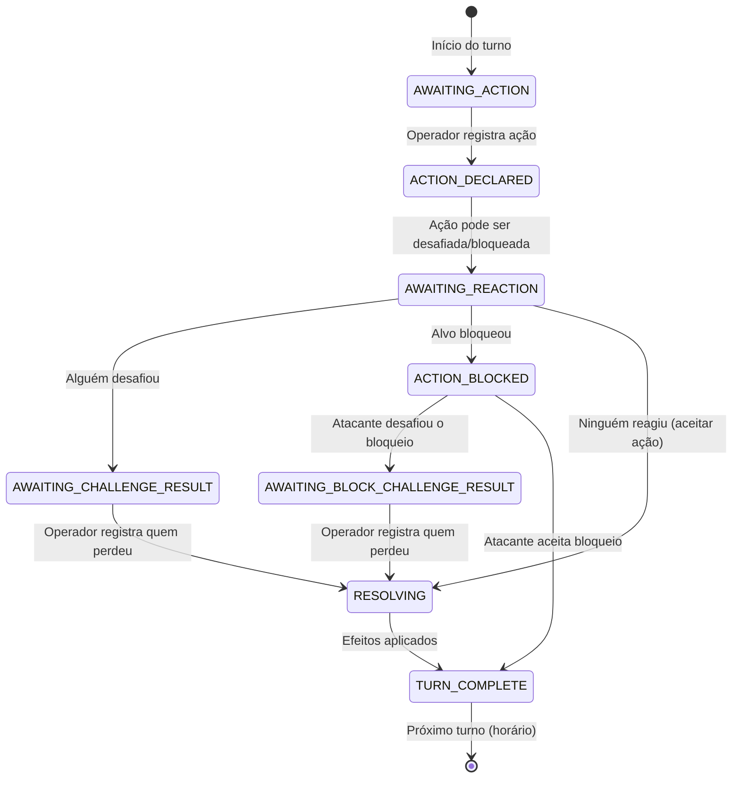

# Coup Scoreboard — Especificação de Arquitetura

> Referência: [specs/product.md](file:///home/matheus-galdino/computacao/coup-scoreboard/specs/product.md)

---

## 1. Visão Geral da Arquitetura

```
┌────────────────────────────┐
│    Frontend (React + TS)   │
│    TailwindCSS + Vite      │
│    SPA com React Router    │
├────────────────────────────┤
│         HTTP/REST          │
├────────────────────────────┤
│   Backend (FastAPI/Python) │
│   Lógica de negócio        │
│   Motor de ações do Coup   │
├────────────────────────────┤
│     Supabase PostgreSQL    │
└────────────────────────────┘
```

**Tipo de arquitetura**: Monolito modular (API REST) com SPA frontend separado.
Sem WebSockets — apenas um dispositivo controla a partida, não há necessidade de tempo real.

---

## 2. Backend — Python + FastAPI

### 2.1 Estrutura de Diretórios

```
backend/
├── app/
│   ├── main.py                  # FastAPI app, CORS, lifespan
│   ├── config.py                # Settings (Supabase URL, keys)
│   ├── database.py              # SQLAlchemy engine + session
│   ├── models/                  # SQLAlchemy ORM models
│   │   ├── __init__.py
│   │   ├── table.py             # Table (mesa)
│   │   ├── player.py            # Player
│   │   ├── match.py             # Match
│   │   ├── match_participation.py
│   │   └── match_event.py       # MatchEvent (log de ações)
│   ├── schemas/                 # Pydantic schemas (request/response)
│   │   ├── __init__.py
│   │   ├── table.py
│   │   ├── player.py
│   │   ├── match.py
│   │   └── leaderboard.py
│   ├── routers/                 # Endpoints agrupados por recurso
│   │   ├── __init__.py
│   │   ├── tables.py
│   │   ├── players.py
│   │   ├── matches.py
│   │   └── leaderboard.py
│   ├── services/                # Lógica de negócio
│   │   ├── __init__.py
│   │   ├── table_service.py     # Criar mesa, gerar slug
│   │   ├── match_service.py     # Criar/cancelar partida, turnos
│   │   ├── action_service.py    # Motor de ações do Coup
│   │   └── leaderboard_service.py
│   └── core/                    # Constantes, enums, exceções
│       ├── __init__.py
│       ├── constants.py         # MIN_PLAYERS=4, MAX_PLAYERS=6, etc.
│       ├── enums.py             # ActionType, EventType, MatchStatus
│       └── exceptions.py        # Exceções de domínio
├── alembic/                     # Migrations
│   └── versions/
├── alembic.ini
├── requirements.txt
└── pyproject.toml
```

### 2.2 Motor de Ações (action_service.py)

Esse é o módulo central. Gerencia o fluxo de turno como uma máquina de estados:

#### Máquina de Estados do Turno



#### Fluxo de Execução por Ação

```
1. Operador seleciona ação para o jogador do turno
         │
         ▼
┌─────────────────────┐
│  Validações          │
│  - Partida ativa?    │
│  - É o turno dele?   │
│  - 10+ moedas → só   │
│    Golpe permitido   │
│  - Moedas suficientes│
│    para a ação?      │
└──────────┬──────────┘
           │
           ▼
┌─────────────────────┐
│  Turno entra em      │
│  AWAITING_REACTION   │
│  (aguarda reações)   │
└──────────┬──────────┘
           │
     ┌─────┼──────────────┐
     │     │              │
  Desafio  Bloqueio   Aceitar
     │     │              │
     ▼     ▼              ▼
  Resolve  Pode ser    Aplica efeitos
  na mesa  desafiado   Avança turno
     │     │
     ▼     ▼
  Operador registra
  quem perdeu vida
         │
         ▼
┌─────────────────────┐
│  Aplica efeitos      │
│  - Moedas ±          │
│  - Vidas ±           │
│  - Kills ++          │
│  Registra MatchEvent │
└──────────┬──────────┘
           │
           ▼
┌─────────────────────┐
│  Checa eliminação    │
│  (0 vidas → posição) │
│  Checa vitória       │
│  (1 jogador vivo?)   │
└──────────┬──────────┘
           │
           ▼
┌─────────────────────┐
│  Avança turno        │
│  (próximo vivo,      │
│   sentido horário)   │
└─────────────────────┘
```

#### Gestão de Turnos

- **Primeiro turno**: Último vencedor da mesa. Se é a 1ª partida, escolhido aleatoriamente.
- **Turnos seguintes**: Sentido horário, saltando jogadores eliminados.
- A ordem é definida pelo campo `turn_order` em `MatchParticipation`.

### 2.3 Geração de Slug (table_service.py)

O slug é gerado automaticamente a partir do nome da mesa:
1. Normaliza (remove acentos, lowercase).
2. Substitui espaços/caracteres especiais por `-`.
3. Se já existe, sufixo numérico (`-2`, `-3`, etc.).

Exemplo: `"Galera do Coup"` → `galera-do-coup`

### 2.4 Enums Principais

```python
class MatchStatus(str, Enum):
    IN_PROGRESS = "in_progress"
    FINISHED = "finished"
    CANCELLED = "cancelled"

class TurnPhase(str, Enum):
    AWAITING_ACTION = "awaiting_action"
    AWAITING_REACTION = "awaiting_reaction"
    AWAITING_CHALLENGE_RESULT = "awaiting_challenge_result"
    ACTION_BLOCKED = "action_blocked"
    AWAITING_BLOCK_CHALLENGE_RESULT = "awaiting_block_challenge_result"
    RESOLVING = "resolving"

class ActionType(str, Enum):
    INCOME = "income"              # +1 moeda
    FOREIGN_AID = "foreign_aid"    # +2 moedas
    COUP = "coup"                  # -7 moedas, -1 vida alvo
    TAX = "tax"                    # +3 moedas (Duque)
    STEAL = "steal"                # +2 moedas, -2 alvo (Capitão)
    ASSASSINATE = "assassinate"    # -3 moedas, -1 vida alvo (Assassino)
    EXCHANGE = "exchange"          # Sem efeito no app (Embaixador)

class EventType(str, Enum):
    ACTION = "action"              # Ação de turno
    CHALLENGE = "challenge"        # Desafio a uma ação
    BLOCK = "block"                # Bloqueio de uma ação
    CHALLENGE_BLOCK = "challenge_block"    # Desafio a um bloqueio
    LOSS_OF_LIFE = "loss_of_life"          # Alguém perdeu vida
    ELIMINATION = "elimination"    # Jogador eliminado (0 vidas)
    VICTORY = "victory"            # Vencedor detectado
```

---

## 3. Frontend — React + TypeScript + TailwindCSS

### 3.1 Estrutura de Diretórios

```
frontend/
├── public/
├── src/
│   ├── main.tsx
│   ├── App.tsx                  # React Router setup
│   ├── api/                     # API client (fetch/axios)
│   │   ├── client.ts            # Base HTTP client
│   │   ├── tables.ts
│   │   ├── players.ts
│   │   ├── matches.ts
│   │   └── leaderboard.ts
│   ├── components/
│   │   ├── layout/
│   │   │   ├── Header.tsx
│   │   │   └── BottomNav.tsx    # Nav mobile (Partida | Leaderboard)
│   │   ├── match/
│   │   │   ├── PlayerCard.tsx   # Card com moedas + vidas
│   │   │   ├── ActionBar.tsx    # Barra de ações (ícones)
│   │   │   ├── ActionModal.tsx  # Confirmação de ação arriscada
│   │   │   ├── ChallengeModal.tsx
│   │   │   ├── WinnerModal.tsx  # Tela de "Parabéns"
│   │   │   └── PlayerGrid.tsx   # Grid de PlayerCards
│   │   ├── leaderboard/
│   │   │   ├── RankingTable.tsx
│   │   │   ├── PlayerDetailsModal.tsx
│   │   │   └── TimeFilter.tsx   # Semanal | Mensal | Geral
│   │   ├── table/
│   │   │   ├── CreateTableForm.tsx
│   │   │   └── PlayerList.tsx
│   │   └── ui/                  # Componentes genéricos
│   │       ├── Skeleton.tsx
│   │       ├── ConfirmDialog.tsx
│   │       └── IconButton.tsx
│   ├── hooks/
│   │   ├── useMatch.ts          # Estado da partida
│   │   ├── useLeaderboard.ts
│   │   └── useTable.ts
│   ├── pages/
│   │   ├── HomePage.tsx         # Landing / criar ou acessar mesa
│   │   ├── TablePage.tsx        # Página da mesa (jogadores + partida)
│   │   ├── MatchPage.tsx        # Partida em andamento
│   │   ├── LeaderboardPage.tsx
│   │   └── MatchHistoryPage.tsx
│   ├── types/
│   │   └── index.ts             # Tipos TypeScript (espelhando schemas)
│   └── lib/
│       └── constants.ts         # Definições de ações, ícones, cores
├── index.html
├── tailwind.config.ts
├── tsconfig.json
├── vite.config.ts
└── package.json
```

### 3.2 Rotas

| Rota | Página | Descrição |
|---|---|---|
| `/` | HomePage | Criar mesa ou inserir slug para acessar uma existente |
| `/:slug` | TablePage | Visão geral da mesa: jogadores, iniciar partida |
| `/:slug/match/:matchId` | MatchPage | Partida em andamento com grid de jogadores e barra de ações |
| `/:slug/leaderboard` | LeaderboardPage | Ranking com filtros temporais |
| `/:slug/history` | MatchHistoryPage | Lista de partidas encerradas |

### 3.3 Fluxo de Telas (Partida)

```
┌──────────────────────────────────────────────────────────┐
│  MatchPage                                               │
│                                                          │
│  ┌────────┐ ┌────────┐ ┌────────┐ ┌────────┐           │
│  │Player 1│ │Player 2│ │Player 3│ │Player 4│  ← Grid   │
│  │♥♥ 🪙3  │ │♥♡ 🪙5  │ │♥♥ 🪙1  │ │💀     │           │
│  │  TURNO │ │        │ │        │ │  ELIM. │           │
│  └────────┘ └────────┘ └────────┘ └────────┘           │
│                                                          │
│  ┌──────────────────────────────────────────────────┐   │
│  │  💰  🤝  ⚔️  👑  🗡️  🔪  🔄       │← ActionBar  │
│  │ Renda Aid Golpe Taxa Roubar Assassinar Trocar   │   │
│  └──────────────────────────────────────────────────┘   │
│                                                          │
│  [Desafiar]  [Bloquear]              ← Ações reativas   │
└──────────────────────────────────────────────────────────┘
```

---

## 4. Banco de Dados (Supabase PostgreSQL)

### 4.1 Schema SQL (Referência)

```sql
-- Mesas
CREATE TABLE tables (
    id          UUID PRIMARY KEY DEFAULT gen_random_uuid(),
    name        VARCHAR(100) NOT NULL,
    slug        VARCHAR(100) NOT NULL UNIQUE,
    created_at  TIMESTAMPTZ NOT NULL DEFAULT NOW()
);

-- Jogadores
CREATE TABLE players (
    id          UUID PRIMARY KEY DEFAULT gen_random_uuid(),
    table_id    UUID NOT NULL REFERENCES tables(id),
    name        VARCHAR(50) NOT NULL,
    created_at  TIMESTAMPTZ NOT NULL DEFAULT NOW(),
    UNIQUE(table_id, name)
);

-- Partidas
CREATE TABLE matches (
    id          UUID PRIMARY KEY DEFAULT gen_random_uuid(),
    table_id    UUID NOT NULL REFERENCES tables(id),
    winner_id   UUID REFERENCES players(id),
    status      VARCHAR(20) NOT NULL DEFAULT 'in_progress',
    current_turn_player_id UUID REFERENCES players(id),
    turn_phase  VARCHAR(40) NOT NULL DEFAULT 'awaiting_action',
    pending_action VARCHAR(30),
    pending_actor_id UUID REFERENCES players(id),
    pending_target_id UUID REFERENCES players(id),
    turn_number INT NOT NULL DEFAULT 1,
    created_at  TIMESTAMPTZ NOT NULL DEFAULT NOW(),
    finished_at TIMESTAMPTZ
);

-- Participações
CREATE TABLE match_participations (
    id              UUID PRIMARY KEY DEFAULT gen_random_uuid(),
    match_id        UUID NOT NULL REFERENCES matches(id),
    player_id       UUID NOT NULL REFERENCES players(id),
    coins           INT NOT NULL DEFAULT 1,
    lives           INT NOT NULL DEFAULT 2,
    finish_position INT,
    kills           INT NOT NULL DEFAULT 0,
    is_eliminated   BOOLEAN NOT NULL DEFAULT FALSE,
    turn_order      INT NOT NULL,
    UNIQUE(match_id, player_id)
);

-- Eventos (log de ações)
CREATE TABLE match_events (
    id          UUID PRIMARY KEY DEFAULT gen_random_uuid(),
    match_id    UUID NOT NULL REFERENCES matches(id),
    actor_id    UUID NOT NULL REFERENCES players(id),
    target_id   UUID REFERENCES players(id),
    action_type VARCHAR(30) NOT NULL,
    event_type  VARCHAR(30) NOT NULL,
    result      VARCHAR(30),
    details     JSONB,
    turn_number INT NOT NULL,
    created_at  TIMESTAMPTZ NOT NULL DEFAULT NOW()
);

-- Índices para performance
CREATE INDEX idx_players_table ON players(table_id);
CREATE INDEX idx_matches_table ON matches(table_id);
CREATE INDEX idx_matches_status ON matches(table_id, status);
CREATE INDEX idx_participations_match ON match_participations(match_id);
CREATE INDEX idx_participations_player ON match_participations(player_id);
CREATE INDEX idx_events_match ON match_events(match_id);
CREATE INDEX idx_matches_finished_at ON matches(table_id, finished_at);
```

### 4.2 Queries Importantes para o Leaderboard

As estatísticas do leaderboard serão computadas via queries agregadas sobre `match_participations` e `match_events`, filtradas por `matches.finished_at` para os filtros temporais:

- **Vitórias**: `COUNT(*) WHERE matches.winner_id = player_id`
- **Partidas jogadas**: `COUNT(*) FROM match_participations WHERE player_id = ?`
- **% de vitórias**: vitórias / partidas jogadas
- **Kills**: `SUM(kills) FROM match_participations`
- **Vezes que desafiou**: `COUNT(*) FROM match_events WHERE actor_id = ? AND event_type = 'challenge'`
- **Vezes que foi desafiado**: `COUNT(*) FROM match_events WHERE target_id = ? AND event_type = 'challenge'`

---

## 5. API REST — Endpoints

### 5.1 Mesas

| Método | Rota | Descrição |
|---|---|---|
| `POST` | `/api/tables` | Criar uma nova mesa |
| `GET` | `/api/tables/:slug` | Obter dados de uma mesa pelo slug |

### 5.2 Jogadores

| Método | Rota | Descrição |
|---|---|---|
| `GET` | `/api/tables/:slug/players` | Listar jogadores da mesa |
| `POST` | `/api/tables/:slug/players` | Cadastrar jogador na mesa |

### 5.3 Partidas

| Método | Rota | Descrição |
|---|---|---|
| `POST` | `/api/tables/:slug/matches` | Criar nova partida (body: lista de player_ids) |
| `GET` | `/api/tables/:slug/matches/:matchId` | Obter estado atual da partida |
| `POST` | `/api/tables/:slug/matches/:matchId/actions` | Registrar uma ação de turno |
| `POST` | `/api/tables/:slug/matches/:matchId/challenge` | Registrar um desafio |
| `POST` | `/api/tables/:slug/matches/:matchId/block` | Registrar um bloqueio |
| `POST` | `/api/tables/:slug/matches/:matchId/resolve` | Resolver desafio/bloqueio (quem perdeu vida) |
| `POST` | `/api/tables/:slug/matches/:matchId/cancel` | Cancelar partida |
| `GET` | `/api/tables/:slug/matches` | Listar histórico de partidas da mesa |

### 5.4 Leaderboard

| Método | Rota | Descrição |
|---|---|---|
| `GET` | `/api/tables/:slug/leaderboard?period=weekly\|monthly\|all` | Ranking da mesa |
| `GET` | `/api/tables/:slug/leaderboard/:playerId` | Detalhes do jogador |

---

## 6. Decisões de Design

| Decisão | Justificativa |
|---|---|
| **REST em vez de RPC** | API baseada em recursos facilita evolução e é padrão com FastAPI. |
| **SQLAlchemy ORM** | Padrão maduro para FastAPI + PostgreSQL, com suporte a migrations via Alembic. |
| **Vite como bundler** | Mais rápido que CRA para desenvolvimento com React + TS. |
| **Slug auto-gerado** | Slug gerado a partir do nome da mesa, com sufixo numérico para colisões. |
| **MatchEvent como log** | Registrar cada ação como evento permite recalcular estatísticas e reconstruir o histórico sem duplicar dados. |
| **Sem WebSockets** | Apenas um dispositivo por partida — polling ou refresh manual é suficiente. |
| **Filtros temporais via query** | Semanal/mensal/geral calculados no backend filtrando `finished_at` — sem necessidade de materializar views. |
| **Turn phase na tabela matches** | O estado do turno (awaiting_action, awaiting_reaction, etc.) fica no banco para ser resiliente a refresh de página. |
| **Interface em PT-BR** | Labels, mensagens e textos da interface em Português do Brasil. |
