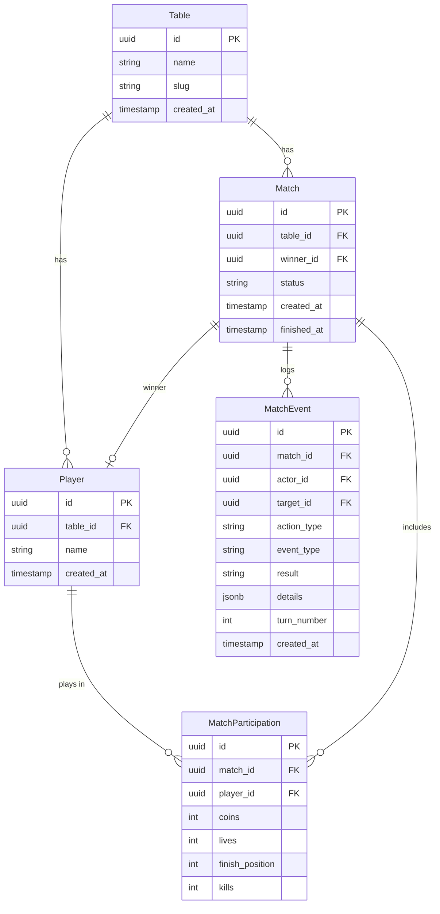

# Coup Scoreboard — Especificação de Produto

## 1. Objetivo do Produto

Fornecer um web app mobile-first para acompanhar partidas do jogo de cartas **Coup** em tempo real. O app funciona como um **painel de controle semi-automático**: o operador registra as ações dos jogadores (roubar, assassinar, renda, etc.) e o sistema aplica os efeitos sobre moedas e vidas automaticamente. Os jogadores resolvem blefes e desafios "na mesa real", e o operador apenas registra quem perdeu vida.

O app também mantém um **leaderboard por mesa** com estatísticas detalhadas de cada jogador.

---

## 2. Usuários e Atores

| Ator | Descrição |
|---|---|
| **Jogador** | Participante da partida de Coup. Representado como uma entidade dentro do sistema; pode interagir diretamente com o app, realizando ações que impactem o estado da partida. |
| **Visitante** | Qualquer pessoa que acessa o app para consultar o leaderboard de uma mesa (não requer autenticação). |

---

## 3. Conceitos-Chave

### 3.1 Mesa

Uma **mesa** é um grupo fixo de amigos que jogam juntos recorrentemente — como uma "liga local". Cada mesa possui:
- Sua própria lista de jogadores cadastrados.
- Seu próprio leaderboard e histórico de partidas.
- Um link compartilhável para acesso (qualquer pessoa com o link pode visualizar e operar).

### 3.2 Motor de Jogo (Semi-Automático)

O app **não gerencia as cartas** dos jogadores. Funciona assim:
1. O operador seleciona qual ação o jogador do turno quer executar (ex: "Assassinar", "Roubar", "Renda").
2. O sistema aplica automaticamente os efeitos de moedas (ex: Assassinar custa 3 moedas).
3. Se houver desafio ou bloqueio, os jogadores resolvem na mesa real.
4. O operador registra o resultado: quem perdeu vida.
5. O sistema **não valida** se o jogador possui ou não a carta — o app confia nos jogadores.

---

## 4. Funcionalidades do MVP

### 4.1 Gerenciamento de Mesa
- Criar uma nova mesa.
- Compartilhar link da mesa para outros jogadores/visitantes.
- Cadastrar jogadores na mesa (nome/apelido único dentro da mesa).
- Listar jogadores da mesa.

### 4.2 Gerenciamento de Partida
- Criar uma nova partida selecionando participantes da lista de jogadores da mesa (4–6 jogadores).
- O sistema inicializa cada jogador com 2 vidas e 1 moeda (exceto o último vencedor: 0 moedas).
- **Ordem dos turnos**: O último vencedor da mesa começa. Se é a primeira partida, o primeiro jogador é escolhido aleatoriamente. Após o primeiro turno de cada jogador, a ordem segue automaticamente em sentido horário (conforme a disposição dos jogadores na tela).
- Durante a partida, o operador registra ações por turno:
  - **Renda**: +1 moeda.
  - **Ajuda Externa**: +2 moedas (pode ser bloqueada).
  - **Ações de Personagem**: Duque (taxa: +3 moedas), Capitão (roubar: +2 moedas, -2 do alvo), Assassino (assassinar: -3 moedas do atacante, -1 vida do alvo), Embaixador (trocar cartas — sem efeito no app), Contessa (bloquear assassinato — sem efeito no app).
  - **Golpe**: -7 moedas, -1 vida do alvo.
- **Fluxo de reações** (Ação → Bloqueio → Desafio ao bloqueio):
  1. O jogador do turno executa uma ação.
  2. Qualquer jogador pode **desafiar** a ação (enquanto o turno não terminou).
  3. O alvo pode **bloquear** a ação (se aplicável).
  4. Se houve bloqueio, o atacante original pode **desafiar o bloqueio**.
  5. Em qualquer desafio: os jogadores resolvem na mesa real e o operador registra quem perdeu vida.
- Quando um jogador tem **10+ moedas**, o sistema obriga o Golpe como única ação disponível.
- O estado da partida (moedas e vidas de todos) é sempre visível na tela sem necessidade de navegação.
- O sistema detecta automaticamente o vencedor (último jogador com vidas > 0) e exibe tela de "Parabéns".
- Deve ser possível cancelar/excluir uma partida em andamento sem declarar vencedor.

### 4.3 Leaderboard
- Exibir ranking dos jogadores da mesa, ordenável por:
  - Número total de vitórias.
  - Porcentagem de vitórias.
- Filtros temporais: **semanal**, **mensal**, **geral** (todos os tempos).
- Visualizar detalhes de um jogador:
  - Histórico de partidas com data.
  - Posição em que terminou cada partida.
  - Quantidade de kills (vidas tiradas).
  - Quantidade de vezes que desafiou.
  - Quantidade de vezes que foi desafiado.
  - Outras estatísticas relevantes.

### 4.4 Histórico de Partidas
- Partidas encerradas ficam acessíveis para consulta.
- Partidas encerradas não podem ser modificadas.

---

## 5. Requisitos Funcionais

| ID | Requisito |
|---|---|
| **RF-01** | O sistema deve permitir criar mesas, gerar slug automaticamente a partir do nome, e fornecer link compartilhável. |
| **RF-02** | O sistema deve permitir cadastrar jogadores em uma mesa com nome/apelido único. |
| **RF-03** | O sistema deve permitir criar uma nova partida selecionando 4–6 participantes da lista de jogadores da mesa. |
| **RF-04** | O sistema deve inicializar jogadores com 2 vidas e 1 moeda (0 para o último vencedor). |
| **RF-05** | O sistema deve permitir registrar ações por turno e aplicar automaticamente os efeitos de moedas e vidas. |
| **RF-14** | O sistema deve gerenciar a ordem dos turnos automaticamente (sentido horário, último vencedor começa). |
| **RF-15** | O sistema deve suportar o fluxo completo de reações: ação → bloqueio → desafio ao bloqueio → resolução. |
| **RF-06** | O sistema deve exibir o estado atual da partida (moedas e vidas de todos) permanentemente na tela. |
| **RF-07** | O sistema deve obrigar o Golpe quando um jogador tem 10+ moedas. |
| **RF-08** | O sistema deve detectar automaticamente o vencedor e exibir tela de "Parabéns". |
| **RF-09** | O sistema deve permitir cancelar uma partida em andamento. |
| **RF-10** | O sistema deve manter um leaderboard por mesa com filtros temporais (semanal, mensal, geral). |
| **RF-11** | O sistema deve permitir visualizar detalhes estatísticos de um jogador (kills, desafios, posição, histórico). |
| **RF-12** | O sistema deve impedir alterações em uma partida já encerrada. |
| **RF-13** | O sistema deve permitir registrar desafios e bloqueios e seus resultados (quem perdeu vida). |
| **RF-16** | O sistema deve gerar o slug da mesa automaticamente a partir do nome informado. |

---

## 6. Requisitos Não Funcionais

| ID | Requisito |
|---|---|
| **RNF-01** | **Mobile-first**: A interface deve ser projetada primariamente para dispositivos móveis, com layout responsivo. |
| **RNF-02** | **Usabilidade**: As interações durante a partida devem ser rápidas e exigir o mínimo de toques. |
| **RNF-03** | **Performance**: A interface de partida deve responder a interações em menos de 100ms. |
| **RNF-04** | **Acessibilidade**: Elementos interativos devem ter alvos de toque de pelo menos 44×44px. |
| **RNF-05** | **Disponibilidade**: O app deve funcionar como uma aplicação web acessível via navegador; não requer instalação. |
| **RNF-06** | **Design**: Design minimalista e moderno, com cores vibrantes e interface limpa. |
| **RNF-07** | **Design**: Usar skeleton para loading states. |
| **RNF-08** | **Design**: Usar ícones para representar as ações possíveis. |
| **RNF-09** | **Design**: Usar confirmações para ações mais arriscadas (ex: assassinar, golpe). |
| **RNF-10** | **Acesso**: Sem autenticação — qualquer pessoa com o link da mesa pode acessar. |
| **RNF-11** | **Dispositivo**: Apenas um dispositivo controla a partida por vez. |

---

## 7. Stack Tecnológico

| Camada | Tecnologia |
|---|---|
| **Frontend** | React + TypeScript + TailwindCSS |
| **Backend** | Python + FastAPI |
| **Banco de Dados** | PostgreSQL (Supabase) |

---

## 8. Entidades Principais

### Descrição das Entidades

| Entidade | Descrição |
|---|---|
| **Table** | Mesa / liga de amigos. Agrupa jogadores e partidas. Possui um slug único para gerar o link compartilhável. |
| **Player** | Jogador cadastrado em uma mesa. Nome/apelido único dentro da mesa. Não pode ser editado nem excluído. |
| **Match** | Uma partida de Coup. Status: `in_progress`, `finished`, `cancelled`. Referência ao vencedor. |
| **MatchParticipation** | Relação entre jogador e partida. Armazena estado atual (moedas, vidas) e estatísticas finais (posição, kills). |
| **MatchEvent** | Log de eventos da partida: ações, desafios, bloqueios e seus resultados. Permite reconstruir o histórico e calcular estatísticas. |

---

## 9. Regras de Negócio

| ID | Regra |
|---|---|
| **RN-01** | Uma partida de Coup tem entre **4 e 6 jogadores**. |
| **RN-02** | Cada jogador começa a partida com **2 vidas**. |
| **RN-03** | Cada jogador começa a partida com **1 moeda**, exceto o último vencedor da mesa que começa com **0 moedas**. |
| **RN-04** | Vidas variam entre **0 e 2**. Não é possível ganhar vidas, apenas perder. |
| **RN-05** | Moedas variam entre **0 e 12** por jogador. |
| **RN-06** | Um jogador com **0 vidas** está eliminado da partida. |
| **RN-07** | O **vencedor** é detectado automaticamente: último jogador com vidas > 0. |
| **RN-08** | Quando um jogador tem **10+ moedas**, a única ação permitida é o **Golpe**. |
| **RN-09** | Uma partida encerrada ou cancelada não pode ser modificada. |
| **RN-10** | O mesmo jogador não pode ser adicionado mais de uma vez à mesma partida. |
| **RN-11** | Nomes de jogadores são **únicos dentro de uma mesa**. |
| **RN-12** | Jogadores **não podem ser editados ou excluídos** após cadastro. |
| **RN-13** | O leaderboard é calculado por mesa, com filtros temporais (semanal, mensal, geral). |

### Tabela de Ações do Coup

| Ação | Custo | Efeito no Alvo | Bloqueável por | Personagem que realiza |
|---|---|---|---|---|
| **Renda** | — | — | — | Qualquer |
| **Ajuda Externa** | — | — | Duque | Qualquer |
| **Golpe** | -7 moedas | -1 vida | — | Qualquer |
| **Taxa (Duque)** | — | — | — | Duque |
| **Roubar (Capitão)** | — | -2 moedas do alvo | Capitão, Embaixador | Capitão |
| **Assassinar (Assassino)** | -3 moedas | -1 vida | Contessa | Assassino |
| **Trocar (Embaixador)** | — | — | — | Embaixador |

> **Nota**: O sistema aplica os efeitos automaticamente, mas **não valida** se o jogador possui a carta. Blefes e desafios são resolvidos na mesa real.

---

## 10. Decisões Consolidadas

Todas as ambiguidades foram resolvidas:

| # | Decisão |
|---|---|
| **D-01** | Sem autenticação — acesso aberto via link da mesa. |
| **D-02** | Mesas são "ligas locais" — grupo fixo de amigos com leaderboard e histórico próprios. |
| **D-03** | Apenas um dispositivo controla a partida. |
| **D-04** | Sistema detecta vencedor automaticamente (último com vidas > 0). |
| **D-05** | Partidas podem ser canceladas sem declarar vencedor. |
| **D-06** | Histórico de partidas acessível após encerramento. |
| **D-07** | Máximo de 12 moedas por jogador. |
| **D-08** | Nomes de jogadores únicos dentro da mesa. |
| **D-09** | Jogadores não podem ser editados ou excluídos. |
| **D-10** | Leaderboard com todas as estatísticas e filtros temporais (semanal, mensal, geral). |
| **D-11** | Dados persistidos no Supabase (PostgreSQL). |
| **D-12** | Sem suporte a múltiplos dispositivos simultâneos na mesma partida. |
| **D-13** | Sem escopo futuro planejado (sem PWA, timer, etc.). |
| **D-14** | Motor semi-automático: operador registra ações, sistema aplica efeitos de moedas/vidas. |
| **D-15** | App não gerencia cartas — desafios resolvidos na mesa real. |
| **D-16** | Golpe obrigatório com 10+ moedas. |
| **D-17** | Bloqueio pode ser desafiado (fluxo completo: Ação → Bloqueio → Desafio ao bloqueio → Resolução). |
| **D-18** | Turnos em sentido horário; último vencedor começa; se 1ª partida, aleatório. |
| **D-19** | Slug da mesa gerado automaticamente a partir do nome (ex: "Galera do Coup" → `galera-do-coup`). |
| **D-20** | Interface do app em Português (BR). |
